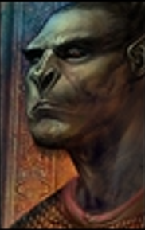

## Rudish Skrift

As the world fades in from blackness, the first sensation is the rhythmic rocking of a carriage. The view is confined, restricted – we see through the eyes of Rudish Skrift. He's in a cramped, metal prison transport, the clanking of chains accompanying every jolt and sway, stemming from the uneven path traveled by the single horse buggy.

Rudish’s large, hands are shackled, the cold iron that would probably bite into an average man's wrists barely registering against his Half-Orc skin. His gaze, initially blurred and unfocused from drowsiness, sharpens as he looks down at his bound hands resting heavily in his lap. The shackles extend to his ankles, chaining him to the floor of the metal carriage. "Captivity?" he questions himself in his thoughts, the word emerging through a haze of grogginess.

The carriage bobs and weaves along an uneven path, its destination unknown. Rudish’s gaze drifts slowly across the interior of the carriage, taking in the starkness of his surroundings. The walls are barren, save for a small barred window that offers a fragmented view of the passing landscape – a blur of greens and browns. The sterility of the carriage is only marred by layers of filth and grime that seem to have accumulated over countless journeys like this one.

Finally, Rudish’s eyes come to an uncomfortable rest straight across from him; a guard occupies the opposite bench. As his vision clears, the details of the guard sharpen into focus – the unmistakable black uniform of the Zhentarim, chain armor that has seen better days, and a face smeared with grime. The guard's grin is unsettling, a mix of contempt and amusement, as he stares at Rudish.

The guard shifts on his bench, the leather of his armor creaking under the movement. This motion stirs the air, bringing with it the pungent odors of horse manure and fresh earth. His eyes, cold and calculating, maintain a disturbingly mesmerized lock on Rudish. There’s an unsettling air of anticipation about him, as if he's waiting for Rudish to break the silence. Perhaps he's simply deriving a little too much satisfaction from seeing the formidable half-orc in chains; for Rudish is no ordinary captive, and capturing him likely means more than just fulfilling duty. In these lands, having Rudish in custody could bring not only considerable bragging rights but perhaps even a handsome reward in gold.

His gaze on the guard is bland, almost disinterested, giving the impression of a man lost in thought. Yet, there's nothing behind it but cold calculation, an assessment of how quickly and efficiently he could neutralize the seemingly inconsequential threat before him. This apparent disinterest, often misinterpreted by others as a lack of awareness, inadvertently gives Rudish an edge. Opponents like the guard, misreading his stoic demeanor as vulnerability, tend to let their guard down, unwittingly playing into his hands. This dynamic, more by accident than design, frequently works in Rudish's favor, allowing him a moment of surprise when it counts the most.

The carriage trundles onward, its relentless motion unchanging. Outside, glimpses of the sky peek through the barred window, shifting from shades of gray to the occasional burst of sunlight, casting fleeting shadows across Rudish's face. Inside, the carriage's rhythmic creaks and groans provide a constant backdrop, punctuated only by the distant, muffled hoofbeats of the horses and the occasional metallic clink of Rudish’s chains. These sounds, mundane yet oddly rhythmic, create a monotonous but tense soundtrack to his journey. In the otherwise prevailing silence, each cycle of these sounds seems to amplify, subtly intensifying the moment, as if charging the air with a quiet yet growing anticipation.

The mounting tension is abruptly shattered as the guard leans forward, breaking the silence. His grin widens mischievously. "You know, they say you're a tough one, RODDISH," he drawls, his thick northern English accent elongating the syllables of Rudish's name, deliberately stressing it to underscore the significance of his captive. The words cut through the carriage's monotonous hum. "Saw your little scuffle at the Red Rock. Made quite the mess, didn't you? You big ol' twat."

"The Red Rock..." The words resonate within Rudish's mind, echoing with a significance that momentarily eclipses everything else. As the guard continues to taunt him, his voice begins to fade, becoming a distant drone in the background. Rudish's focus narrows to that single memory, the vivid recollections of the night before starting to surface with startling clarity. The present moment, the carriage, the clinking chains – all recede into a hazy periphery as he's drawn deeper into the flashback, his reality momentarily suspended in the grip of the past.

**Flashback:**

In the hazy depths of his recollection, the scene from the night before at the Red Rock tavern in Dagger Falls unfolds. As Rudish Skrift entered, the tavern seemed to momentarily pause – a few heads turned in recognition, and a soft murmur rippled through the crowd. The memory played out with a faint, dreamlike quality, the sounds and sights slightly blurred by the passage of time. He found a table at random and sat with his back to the door, an action reflective of him, a Half-orc whose wisdom amounted to that of a weathered boulder. The danger of such casual disregard for strategic positioning was lost to him, inherent in his very nature. His size, strength, and brutality, coupled with an uncanny ability to become part of the backdrop, not taking up social space in situations like these, were what got him by – a blend of attributes some might call luck.

His gaze scanned the room with keen alertness, belying the recklessness of his lone presence in Dagger Falls. Here, where diversity was a norm, the sight of Rudish – a solitary half-orc – still unsettled the regulars. His calm traverse through the tavern, undisturbed by the undercurrent of tension his presence induced, spoke of a frequent, albeit uneasy, acceptance. The locals' discomfort was palpable, a silent testimony to the deep-seated prejudices that lingered even in a town as varied as Dagger Falls.

Under normal circumstances, Rudish's ability to blend into the background would gradually kick in, and the initial surprise of his presence would eventually dull, melting back into the hum of busy conversations and clinking tankards. But those were times when he was in the company of other adventurers, ones of more commonly accepted races and appearances. This time, however, he was alone – and that solitude cast his imposing figure in a stark, unsoftened light, maintaining the edge of tension in the air.

Lost in the depths of his recollection, Rudish was momentarily adrift in the memory of the tavern. The ambient sounds of the present, the creaking carriage and the distant hoofbeats, melded into the background noise of his thoughts. He was back at the Red Rock, the weight of the stares, the tension in the air, all vividly replaying in his mind.

Suddenly, a sarcastic question from the guard pierced through the fog of his memory. "But fuckin' murder?!" the guard sneered, his words echoing jarringly in the stillness of the carriage. It was like a key turning in a lock, snapping Rudish back to a specific moment in the tavern. His memory sharpened, focusing on what came next: the gradual buildup of unease around him, a challenge from a brash patron, born of the tension Rudish’s presence had created and fueled by too much ale.

They weren't there this time, his usual companions who deftly handled such situations, leaving him adrift in a scenario that was not his domain. What was he supposed to do? He didn't think; he never did when things escalated this far. He did what he always did, what he was conditioned to do – remove the threat. It was but a moment, not a snap of anger but a reaction, an instinct. He played his part, but on the wrong stage, and the room erupted into chaos around him.

Rudish stood up, his gaze sweeping over the fallen figure without a trace of passion. In his eyes, there was no flicker of regret, no hint of second-guessing. The incident was merely a problem that had presented itself and one he had promptly solved – nothing more.

Realizing it was time to leave, Rudish walked out of the tavern with the same casualness as he had entered. The chaos that had erupted in the wake of the patron's abrupt death quickly gave way to stunned silence, a stark contrast to the frenzy just moments before. The remaining patrons, steeped in palpable shock, watched as Rudish departed. For them, the altercation was a jarring burst of violence, an unsettling disruption in their otherwise mundane evening.

For Rudish, the decision to leave was practical, not borne of any moral deliberation. It was clear that what had transpired would set him apart from the anonymity he preferred. The altercation wasn't a matter of right or wrong to him; someone had simply reaped the consequences of their own actions. However, reading the room's shift to a tense stillness, he recognized that fading into the background once again meant stepping out the door. It wasn't about guilt or innocence—it was about maintaining the unobtrusive existence that had always served him best.

**Exit Flashback:**